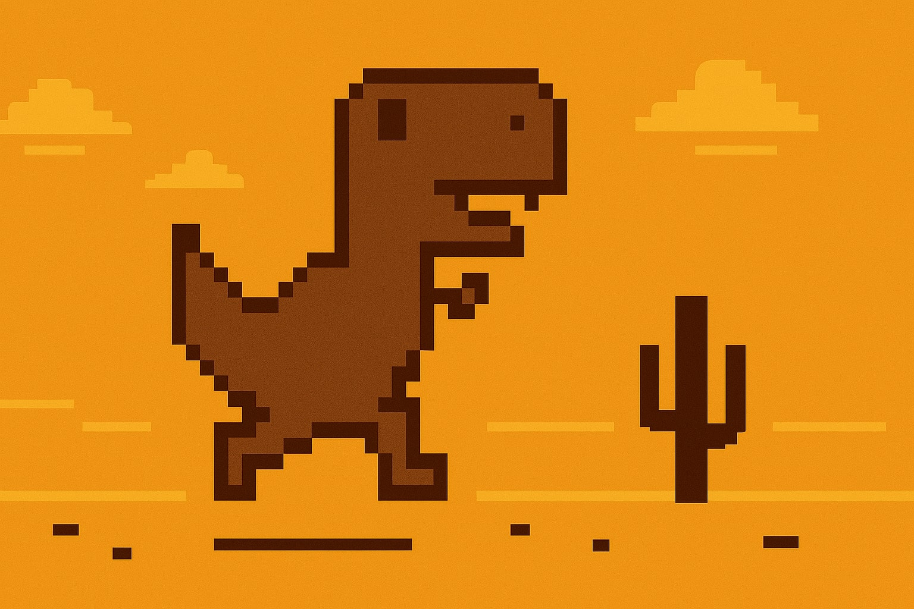

# T-Rex



**Welcome to T-Rex** — an exciting spin on the classic Chrome T-Rex runner. Instead of pressing spacebar, you **literally jump** while holding your phone, and watch T-Rex leap on the big screen!

Try out the game at [trex.rohittp.com](https://trex.rohittp.com/)

## Table of Contents

1. [Overview](#overview)
2. [How It Works](#how-it-works)
3. [Running Locally](#running-locally)
4. [Project Structure](#project-structure)
5. [Contributing](#contributing)
6. [License](#license)

---

## Overview

Originally inspired by the famous **Chrome offline T-Rex game**, we’ve given it a modern twist: real-world motion input via your phone.
- No more button mashing.
- No more arrow key spam.
- It’s time to jump and let your phone handle the rest!

---

## How It Works

1. **Server**: A Node.js/Express app with WebSockets keeps track of multiple game sessions.
2. **Desktop Browser**: Displays the T-Rex game (HTML5 Canvas) and listens for jump signals from the server.
3. **Phone / Controller**: Opens a special controller page, uses device motion APIs to detect your jumps, and sends jump commands via WebSocket to the server.

---

## Running Locally

### 1. Clone the Repo

```bash
git clone https://github.com/yourusername/t-rex-motion-game.git
cd t-rex-motion-game
```

### 2. Install Dependencies

```bash
bun install
```

### 3. Generate Self signed certificate

```bash 
openssl genpkey -algorithm RSA -out private.key
openssl req -new -key private.key -out certificate.csr
openssl x509 -req -days 365 -in certificate.csr -signkey private.key -out certificate.crt
```

### 4. Move the certificate to the certificate folder

```bash
mkdir certificate
mv private.key certificate.crt certificate/
rm certificate.csr
```

### 5. Run the Server

```bash
bun run dev
```

### 6. Open in Browser

- Go to [https://localhost:3000](http://localhost:3000) on **desktop**.
- Look for the **Game ID** displayed.

### 7. Phone as Controller

- On your phone, navigate to [https://<your-computer-ip>:3000]()
- Enter the **Game ID**.
- Start jumping!

---


## Project Structure

A quick look at the main directories and files:

```
.
├── public
│   ├── css
│   │   ├── index.css
│   │   ├── controller.css
│   │   └── game.css
│   ├── images
│   │   └── cover.jpg        # Our epic cover image
│   ├── js
│   │   ├── index.js
│   │   ├── controller.js
│   │   ├── motion.js
│   │   └── runner
│   │       ├── Runner.js
│   │       ├── Trex.js
│   │       ├── ...
│   │       └── collisionHelpers.js
│   ├── game.html            # Game page
│   ├── controller.html      # Phone interface
│   └── index.html           # Desktop landing page
├── index.ts                 # The Express/WS server
├── tsconfig.json                 
└── package.json
```

- **`public/`**: Frontend code, including HTML, CSS, images, and client JS.
- **`runner/`**: Modular classes for the T-Rex game (Trex, Horizon, Obstacles, etc.).
- **`index.ts`**: The Node/Express + WebSocket server.

---

## Contributing

We’d love your help to make the T-Rex game even better! Feel free to:
1. **Fork** the repo
2. Create a **branch** for your feature or fix (`git checkout -b feature/my-awesome-idea`)
3. **Commit** your changes (`git commit -m 'Add my awesome idea'`)
4. **Push** to your branch (`git push origin feature/my-awesome-idea`)
5. **Open a Pull Request** and we’ll review ASAP.

---

## License

This project is licensed under the **MIT License** — you’re free to use, modify, and distribute it. See the [LICENSE](LICENSE) file for details.

---

### Thank You for Playing!

Thanks for checking out T-Rex Motion Game. We hope you have a blast jumping around and making the little dino dodge cacti. If you have questions or run into any issues, please [open an issue](https://github.com/yourusername/t-rex-motion-game/issues).

Let’s jump to it — literally!  
